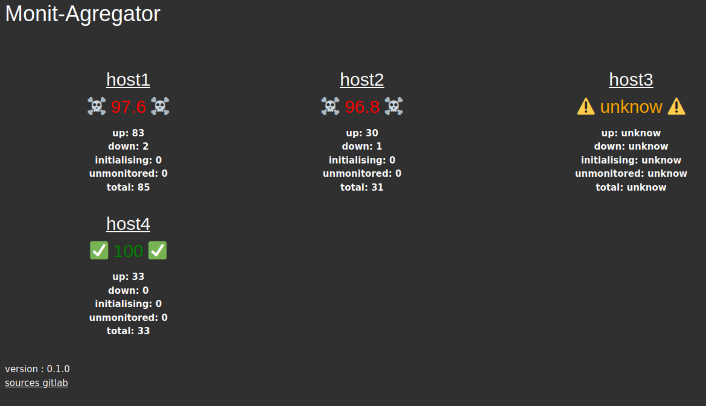

# Monit-Agregator

Web interface for visualize the status of multiples Monit instances.

[Monit](https://mmonit.com/wiki/Monit/HowTo) is a free open source utility for managing and monitoring, processes, programs, files, directories and filesystems on a UNIX system.

You can see status of services with a webui, but only for one host.
You can see all hosts with [M/Monit](https://mmonit.com/wiki/MMonit/Setup), but it's not free and open source 😥, Monit-Agregator is a very light alternative.

## Screenshot



## Installation

With **cargo** :
```
cargo install monit-agregator
```

From sources :
```
git clone https://github.com/thasos/monit-agregator
cd monit-agregator
cargo build --release
ls -l target/release/monit-agregator
```

## Configuration

Create a file `Settings.yaml` :

```yaml
---
ip: "0.0.0.0"
port: 3030
wait_period: 60      # refresh period for hosts status
hosts:
  - name: "host1"                                  # name displayed in webui
    url: "http://192.168.0.1:28"                   # url the binary access
    public_url: "https://monit.domain.com/host1/"  # optional
  - name: "host2"
    url: "http://192.168.0.2:28"
```

## Start

```
monit-agregator -c Settings.yaml
```

## Usage

```bash
Watchdog Monit agregator, very light M/Monit alternative

USAGE:
    monit-agregator [OPTIONS]

OPTIONS:
    -b, --bind-ip <BIND_IP>
            bind ip to listen [default: 127.0.0.1]

    -c, --config <CONFIG>
            config file path [default: Settings.yaml]

    -h, --help
            Print help information

    -l, --loglevel <LOGLEVEL>
            possible values : error warn info debug trace [default: info] [default: info]

    -p, --port <PORT>
            port to listen [default: 3030]

    -r, --refresh-period <REFRESH_PERIOD>
            sleep duration between refresh of monit status for each instance [default: 60]

    -V, --version
            Print version information
```
